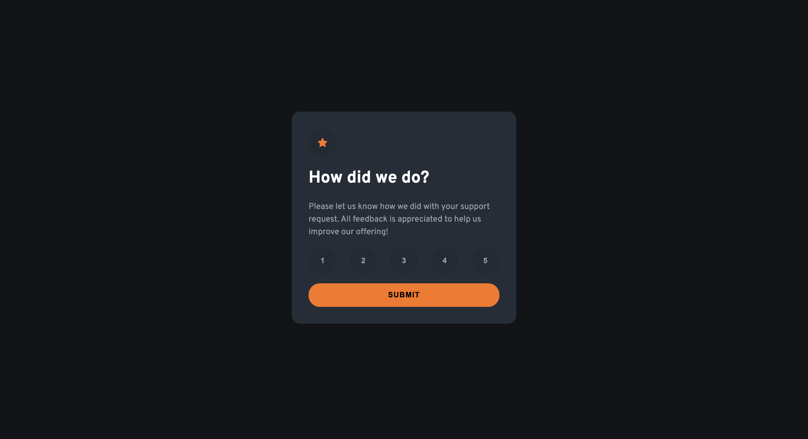

# Frontend Mentor - Interactive rating component solution

This is a solution to the [Interactive rating component challenge on Frontend Mentor](https://www.frontendmentor.io/challenges/interactive-rating-component-koxpeBUmI). Frontend Mentor challenges help you improve your coding skills by building realistic projects.

## Table of contents

- [Overview](#overview)
  - [The challenge](#the-challenge)
  - [Screenshot](#screenshot)
  - [Links](#links)
- [My process](#my-process)
  - [Built with](#built-with)
  - [Continued development](#continued-development)
- [Author](#author)

## Overview

### The challenge

Users should be able to:

- View the optimal layout for the app depending on their device's screen size
- See hover states for all interactive elements on the page
- Select and submit a number rating
- See the "Thank you" card state after submitting a rating

### Screenshot

### Links

- Solution URL: [https://www.frontendmentor.io/solutions/interactive-rating-component-built-using-vanilla-javascript-lZH\_-4kaSb](https://www.frontendmentor.io/solutions/interactive-rating-component-built-using-vanilla-javascript-lZH_-4kaSb)
- Live Site URL: [https://interactive-rating-component-five-sepia.vercel.app/](https://interactive-rating-component-five-sepia.vercel.app/)

## My process

### Built with

- Semantic HTML5 markup
- CSS custom properties
- Flexbox
- Mobile-first workflow

### Continued development

I want to improve my knowledge of the DOM manipulation, so future projects i will be undertaking will involve working with the DOM.

## Author

- Frontend Mentor - [@theadusamuel](https://www.frontendmentor.io/profile/theadusamuel)
